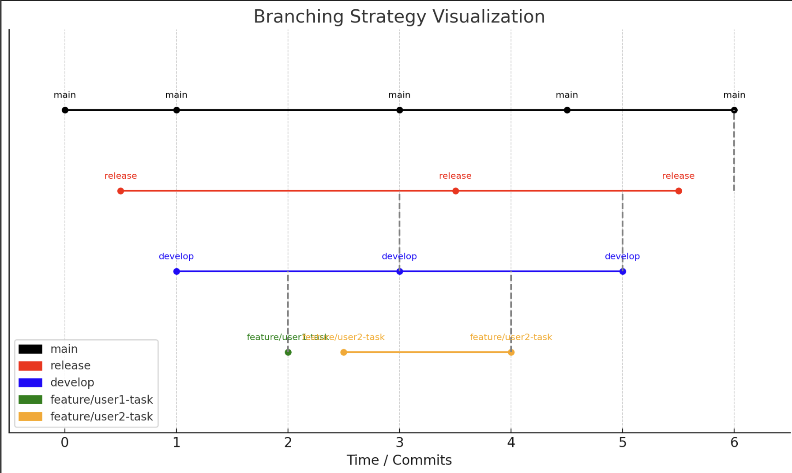

# Pre-Meeting #1 - Talking Points

- **Open Door Policy (Model)**

  - Establish an open line of communication for team collaboration and support.
- **Team Deadlines**

  - Set internal team deadlines that might be more flexible than hard deadlines.
  - Create a poll to determine reasonable deadlines for everyone.
- **User Stories, Time Log, Scrum**

  - Define user stories clearly.
  - Maintain a time log for accountability.
  - Regular scrum meetings to track progress and address issues.
- **Git Branch Setup**

  - Establish clear branching strategy for effective version control.
- **Useful Development Tools**

  - **Git Desktop**: User-friendly Git interface.
  - **VSCode (Markdown Extension)**: Efficient for documentation and notes.
  - **Git Bash**: Command-line Git for efficient use.
- **Documentation**

  - Create `.md` files for time logs as a redundancy measure to ensure data safety.

---

# Project Template Branching Strategy

## Visual Representation of Branching Strategy:

- **Main Branch**: Represents the stable version, with final merges from the release branch.
- **Release Branch**: Used for preparing the final product, merged from the development branch.
- **Develop Branch**: Represents the integration branch where individual features are merged.
- **Feature Branches** (e.g., `feature/user1-task`, `feature/user2-task`): Where each teammate works on their tasks independently.

## Step-by-Step Branching Approach:

1. **Main Branch**:

   - Create a `main` branch as the central repository for **stable, production-ready versions**.
2. **Release Branch**:

   - Create an initial `release` branch for the **project template/preview**, and push the base version into it.
3. **Develop Branch**:

   - Once the template is finalized, **merge into a `develop` branch**.
   - The `develop` branch serves as the shared working branch for the team.

## Workflow for Teammates During the First Meeting:

- Teammates **pull from the `develop` branch**.
- Each teammate creates their own **feature branch** from `develop` (e.g., `feature/user1-task`).

## Branch Flow Summary:

1. **Release Branch**: Store the project template/preview.
2. **Merge into Develop**: Merge the template into `develop` once ready.
3. **Teammates Create Feature Branches**: Each teammate creates a feature branch off of `develop`.

This approach ensures:

- Stability in the `release` branch.
- `Develop` branch as a shared integration point.
- Feature branches for independent work, reducing conflicts.

---

# Meeting #1 Details

- **Location**: [Specify Location]
- **Time & Date**: 11:00 AM - TBD, Friday, October 4, 2024

## Tasks Completed:

- [List completed tasks during/after the meeting]

---
